# HackAlem AI — local meeting protocols

A Windows-first application that turns meeting audio into timestamped speaker transcripts, evidence-backed tasks, decisions, summaries, and DOCX/PDF protocols. Russian, Kazakh and mixed speech use multilingual recognition; accuracy depends on the downloaded models and audio quality.

## Development handoff

To continue in OpenCode, use [the continuation prompt](docs/OPENCODE_PROMPT.md). It links to the [implementation history](docs/IMPLEMENTATION_HISTORY.md), [remaining work](docs/REMAINING_WORK.md), and [design review](docs/DESIGN_REVIEW.md). These distinguish completed implementation and recorded tests from real-model validation still required.

## Architecture

```mermaid
flowchart LR
    UI[Browser dashboard] --> API[FastAPI · 27361]
    API --> DB[(SQLite and local audio)]
    API --> FF[ffmpeg · mono 16 kHz WAV]
    FF --> ASR[faster-whisper]
    ASR --> DIA[pyannote speaker turns]
    DIA --> ALIGN[Word timestamps and speaker alignment]
    ALIGN --> CHUNK[Complete segment chunks]
    CHUNK --> QWEN[Local llama-server · 127.0.0.1:27362]
    QWEN --> VERIFY[Evidence verification and deduplication]
    VERIFY --> DATE[Deterministic deadline resolution]
    DATE --> DB
    DB --> EXPORT[DOCX and Unicode PDF]
    DB --> UI
```



This is a bounded domain pipeline. There are no model-controlled shell commands, filesystem tools, recursive agents, cloud providers, or arbitrary tool registries. Model adapters run sequentially and release their models before the next stage. SQLite stores complete meeting records transactionally, with audio paths in a private column that never appears in API responses.

Meeting processing is local. The LLM client accepts only HTTP 127.0.0.1, ignores proxy environment variables and refuses redirects. Speech adapters require cached models and set Hugging Face offline mode and telemetry opt-outs. Network access is needed only when you explicitly install dependencies or download models before processing. No recordings or transcripts are uploaded during setup.

## Layout

- `src/meeting_protocol/`: settings, models, deadline resolver, local LLM client, extraction, audio adapters, processor, SQLite store, API, exports and static UI.
- `prompts/`: four domain-specific JSON extraction/verification/mapping/summary prompts.
- `scripts/`: Windows launchers and optional real-model integration runner.
- `tests/fixtures/`: synthetic transcript fixtures; no model downloads in tests.
- `initial_data/`: original recordings and reference protocols, preserved unchanged.
- `data/`: ignored uploads, normalized audio, SQLite and generated results.
- `models/`: optional ignored local speech model directories.
- `.env`: existing local settings, never overwritten or committed.

## Install Python and dependencies

Use Python 3.12 on Windows 10/11. The paths below are examples; substitute your actual checkout path. From PowerShell:

```powershell
cd C:\projects\hack-2b778d9f-mnist
uv python install 3.12
uv venv .venv-meeting --python 3.12
uv pip install --python .venv-meeting/Scripts/python.exe -e '.[dev]'
```

Alternatively, with the Python launcher: `py -3.12 -m venv .venv-meeting`, then `.\.venv-meeting\Scripts\python.exe` with `-m pip install -e ".[dev]"`.

Install speech dependencies separately (large PyTorch download):

```powershell
uv pip install --python .venv-meeting/Scripts/python.exe -e '.[models]'
```

The current checkout includes `.venv-meeting`; the pre-existing `.venv` was broken and was left untouched. Runtime dependencies are version-ranged; `requirements-tested.txt` captures the lightweight environment used for verification. Heavy model dependencies are separate and need validation on the demo machine.

## Configure

Copy `.env.example` to `.env` only if `.env` does not already exist. Existing scaffold keys are ignored; add the new focused keys manually. Environment variables override `.env`, so temporary PowerShell overrides work without editing secrets.

Use forward slashes for paths:

```dotenv
MODEL_PATH=C:/projects/hack-2b778d9f-mnist/Qwen3.5-4B-UD-Q6_K_XL.gguf
LLAMA_SERVER_PATH=C:/tools/llama.cpp/llama-server.exe
DIARIZATION_MODEL=C:/models/speaker-diarization-community-1
```

The GGUF stays in its existing location. It is never copied, moved, hashed, served over HTTP or committed. `*.gguf` is ignored.

## ffmpeg and llama.cpp

Install ffmpeg, for example `winget install Gyan.FFmpeg`, then reopen PowerShell and run `ffmpeg -version`. If it is not on PATH, set `FFMPEG_PATH` to the executable. The application decodes uploads using an argument array and accepts formats supported by your ffmpeg build, including WAV, MP3, M4A and MP4. Audio input must be a standalone local media file, not a playlist of remote URLs.

Install a recent Windows CUDA build of [llama.cpp](https://github.com/ggml-org/llama.cpp/releases) that supports your Qwen GGUF, and check `llama-server --help`. The launcher also inspects help at runtime, selects advertised flags, and fails with an actionable message for incompatible versions. llama-server was unavailable during implementation, so its actual model startup remains a manual integration check.

Start it in a separate terminal:

```powershell
.\scripts\start_llama_server.ps1
```

Explicit paths and reduced VRAM usage:

```powershell
.\scripts\start_llama_server.ps1 -LlamaServerPath 'C:\tools\llama.cpp\llama-server.exe' -ModelPath 'C:\projects\hack-2b778d9f-mnist\Qwen3.5-4B-UD-Q6_K_XL.gguf' -CtxSize 4096 -GpuLayers 20
```

It always binds to `127.0.0.1`; there is no option to expose llama-server to the LAN. Keep `LLM_CONTEXT_SIZE` aligned with `-CtxSize` and `LLM_BASE_URL` aligned with `-Port`. Defaults: port 27362, context 8192, temperature 0.1, max output 2048, GPU layers 99. Paths with spaces are preserved with a PowerShell argument array; no `Invoke-Expression` is used. Structured output follows the [llama.cpp server API](https://github.com/ggml-org/llama.cpp/blob/master/tools/server/README.md); unsupported response formats fall back to JSON-only prompts and one bounded repair attempt.

## Speech model preparation

ASR defaults to `large-v3-turbo`, CPU, int8. Before offline use, explicitly download/cache the faster-whisper model (after installing model dependencies):

```powershell
.\.venv-meeting\Scripts\python.exe -c "from faster_whisper import WhisperModel; WhisperModel('large-v3-turbo', device='cpu', compute_type='int8')"
```

You can instead set `ASR_MODEL` to an already-downloaded CTranslate2 model directory. Application processing always uses `local_files_only=True`. Recognition uses automatic language detection plus multilingual decoding and word timestamps, following [faster-whisper](https://github.com/SYSTRAN/faster-whisper). It never forces Russian. Set `ASR_DEVICE=cuda` and a supported compute type only after validating available VRAM.

For diarization, accept the [pyannote community-1 model conditions](https://huggingface.co/pyannote/speaker-diarization-community-1) in your own Hugging Face account and download a complete offline model directory using that model card's offline instructions (Git LFS weights must actually be downloaded, not pointer files). Set `DIARIZATION_MODEL` to that directory. A cached model ID is also accepted, but offline resolution must succeed. Download credentials are used only by your setup tools; the application does not need or use an HF token. Default `DIARIZATION_DEVICE=cpu`. Missing configuration is an explicit error, never fake single-speaker diarization. The adapter passes decoded waveform data to pyannote to avoid an additional media decoder dependency at inference.

## Start the application

```powershell
.\scripts\start_app.ps1
```

Equivalent exact command:

```powershell
.\.venv-meeting\Scripts\python.exe -m meeting_protocol
```

Open **http://127.0.0.1:27361**. Create a meeting, optionally supply its date and one participant per line, upload audio, then start processing. Status updates appear automatically. Review tasks, update their status, correct speaker names, click Source to seek the audio, and export DOCX/PDF. Audio playback uses an authenticated fetch and a temporary browser blob URL, keeping the key out of URLs. Original-format playback depends on browser codec support; completed meetings use normalized WAV.

If an API key is already configured in the preserved `.env`, enter it in the UI and click Connect. It is kept only in sessionStorage. All `/api/v1/*` endpoints require the key when configured. `/health` is unauthenticated and returns only `{"status":"ok"}`.

## LAN demonstration

Set `PUBLIC_HOST=0.0.0.0` and a non-placeholder `AGENT_API_KEY` of at least 16 characters. Generate one with Python's `secrets.token_urlsafe(32)`. Open `http://<your-PC-LAN-IP>:27361` from the other machine and enter the key. Permit only the application port in Windows Firewall; keep llama-server loopback-only. Use a trusted demo LAN; built-in HTTP is not TLS. Start only one application worker: the queue is in-process and supports one heavy job at a time. Interrupted jobs become failed on restart and can be retried.

## Process supplied recordings

The two directories contain MP3 recordings and reference protocol PDFs. The UI accepts either MP3 without changing its original. You can discover exact names with:

```powershell
Get-ChildItem .\initial_data\recordings -Recurse -File
```

With the app and all models running:

```powershell
.\.venv-meeting\Scripts\python.exe scripts/manual_integration.py --audio-dir initial_data/recordings/audio1 --title 'Meeting 1' --date 2026-09-23
```

The date above is an example; supply the actual meeting date or omit it. Do not infer it from the file creation date. The runner reads the recording, uploads to the local API, polls status, and saves JSON/DOCX/PDF under `data/manual/`. It reads the API key from environment or `.env`; no key goes in a URL. Use `audio2` similarly. Original reference PDFs are not modified or used as generated predictions.

## Tests and checks

```powershell
$env:PATH = "$PWD\.venv-meeting\Scripts;$env:PATH"
python -m pytest
python -m ruff check src/meeting_protocol tests scripts/manual_integration.py
python -m mypy
```

Tests use stored synthetic Russian/Kazakh transcripts, fake structured responses and isolated temporary SQLite databases. No model server, GGUF, speech downloads or network is required. They cover deadline rules, missing dates, invalid JSON and bounded repair, chunking, speaker alignment, evidence rejection, name correction, Unicode exports, API health/auth/upload, persistence and a complete processor run using injected adapters.

## Deadline and evidence semantics

Exact dates without a year use the supplied meeting year; a date earlier than the meeting is flagged for review, never silently rolled forward. `до пятницы` and `к среде` mean the next occurrence including the meeting day. `на этой неделе` and `на следующей неделе` use Sunday as the end of that week; `через две недели` adds 14 days. Without a meeting date, relative dates and yearless dates stay unresolved and reviewable. Explicit dates with a year can resolve independently. Event dependencies retain their raw text. Missing deadlines stay null. Unsupported expressions, including currently unsupported Kazakh date wording, are preserved for review.

Evidence quotations and interval boundaries must match supplied transcript segments. Unsupported actions are removed by the verifier, unsupported people/deadlines are nulled and flagged. Deterministic quotation checks add another guard but cannot prove semantic correctness. Low-confidence identities remain speaker labels; manual corrections take precedence. No automatic name is applied below confidence 0.85.

## Exports

DOCX uses python-docx. PDF uses ReportLab directly, without Word or LibreOffice; it embeds an installed Unicode TTF at export time. Windows Arial and Linux DejaVu Sans are searched by default. Set `PDF_FONT_PATH` if neither is available. No proprietary font file is bundled in Git. Both exports include metadata, summary, decisions, task statuses/review markers and the full speaker transcript. Review the protocol before circulation.

## RTX 4050 6 GB stability

1. Keep ASR on CPU with int8.
2. Keep diarization on CPU.
3. Reduce llama.cpp GPU layers, e.g. `-GpuLayers 20`.
4. Reduce context to 4096 in both launcher and application settings.
5. Process stages sequentially (the default); use one application worker.
6. Close other GPU-heavy applications.

99 layers attempts maximum offload but is not a guarantee that the model and its KV cache fit. CPU speech processing is slower but safer for a live demo. The app loads and releases speech models per job; llama-server stays resident separately.

## Limitations and future work

- Real Qwen/ASR/pyannote integration requires installed model dependencies and weights and has not been verified by the offline tests.
- Crosstalk, distant microphones, very short turns and mixed-language ASR errors can reduce accuracy. Uncovered words use UNKNOWN, not a fabricated speaker.
- Chunking preserves complete segments; extremely long segments fail explicitly. Context budgeting is conservative, not exact tokenizer counting. Tasks spanning chunk boundaries may be missed; deduplication is conservative.
- Summaries are hierarchical, can omit nuance, and require human review. Verification reduces hallucinations but does not eliminate them.
- Existing task status edits are replaced when a meeting is reprocessed. Manual speaker mappings are retained for matching speaker labels, but labels may change if the diarization model changes.
- Browser audio blobs may consume substantial RAM for long normalized recordings. The current dashboard is aimed at a small hackathon workload, not multi-user production.
- One JSON record per meeting favors simplicity over sophisticated database queries. No distributed queue, reminders or automatic retry loop.
- Future work: Teams/Zoom/Meet ingestion, reminders, SED integration, richer dashboard, overlapping extraction windows, calibrated confidence and evaluation against the preserved reference protocols.
