# HackAlem AI — local meeting protocols

A Windows-first application that turns meeting audio into timestamped speaker transcripts, evidence-backed tasks, decisions, summaries, and DOCX/PDF protocols. Russian, Kazakh and mixed speech use multilingual recognition; accuracy depends on the downloaded models and audio quality.

## Development handoff

To continue in OpenCode, use [the continuation prompt](docs/OPENCODE_PROMPT.md). It links to the [implementation history](docs/IMPLEMENTATION_HISTORY.md), [remaining work](docs/REMAINING_WORK.md), and [design review](docs/DESIGN_REVIEW.md). These distinguish completed implementation and recorded tests from real-model validation still required.

The [model-selection handoff](docs/MODEL_SELECTION.md) describes the implemented, offline/fake-tested per-operation configuration: requested default identities are `pyannote/speaker-diarization-3.1`, `openai/whisper-large-v3-turbo` (a separate local CTranslate2 artifact), and the existing Qwen GGUF. These models have **not** been installed and run together on real audio; a configured profile is not a verified model.

## Architecture

```mermaid
flowchart LR
    UI[Browser dashboard] --> API[FastAPI · 27361]
    API --> DB[(SQLite and local audio)]
    API --> FF[ffmpeg · mono 16 kHz WAV]
    FF --> ASR[faster-whisper]
    ASR --> DIA[pyannote speaker turns]
    DIA --> ALIGN[Word timestamps and speaker alignment]
    ALIGN --> CHUNK[Complete segment chunks]
    CHUNK --> QWEN[Local llama-server · 127.0.0.1:27362]
    QWEN --> VERIFY[Evidence verification and deduplication]
    VERIFY --> DATE[Deterministic deadline resolution]
    DATE --> DB
    DB --> EXPORT[DOCX and Unicode PDF]
    DB --> UI
```



This is a bounded domain pipeline. There are no model-controlled shell commands, filesystem tools, recursive agents, cloud providers, or arbitrary tool registries. Model adapters run sequentially and release their models before the next stage. SQLite stores complete meeting records transactionally, with audio paths in a private column that never appears in API responses.

Meeting processing is local. LLM endpoints must use HTTP `127.0.0.1` (not `localhost` or another loopback address); the client ignores proxy environment variables and refuses redirects. Speech adapters require complete local models and set Hugging Face offline mode and telemetry opt-outs. Network access is needed only when you explicitly install dependencies or download models before processing. No recordings or transcripts are uploaded during setup.

## Layout

- `src/meeting_protocol/`: settings, profile catalog, models, deadline resolver, local LLM client, extraction, audio adapters, processor, SQLite store, API, exports and static UI.
- `prompts/`: four domain-specific JSON extraction/verification/mapping/summary prompts.
- `scripts/`: Windows launchers and optional real-model integration runner.
- `tests/fixtures/`: synthetic transcript fixtures; no model downloads in tests.
- `initial_data/`: original recordings and reference protocols, preserved unchanged.
- `data/`: ignored uploads, normalized audio, SQLite and generated results.
- `models/`: optional ignored local speech model directories.
- `.env`: existing local settings, never overwritten or committed.

## Install Python and dependencies

Use Python 3.12 on Windows 10/11. The paths below are examples; substitute your actual checkout path. From PowerShell:

```powershell
cd C:\projects\hack-2b778d9f-mnist
uv python install 3.12
uv venv .venv-meeting --python 3.12
uv pip install --python .venv-meeting/Scripts/python.exe -e '.[dev]'
```

Alternatively, with the Python launcher: `py -3.12 -m venv .venv-meeting`, then `.\.venv-meeting\Scripts\python.exe` with `-m pip install -e ".[dev]"`.

Install speech dependencies separately (large PyTorch download):

```powershell
uv pip install --python .venv-meeting/Scripts/python.exe -e '.[models]'
```

The current checkout includes `.venv-meeting`; the pre-existing `.venv` was broken and was left untouched. Runtime dependencies are version-ranged; `requirements-tested.txt` captures the lightweight environment used for verification, including PyYAML 6.0.3 for pipeline-config parsing. Heavy model dependencies are separate and need validation on the demo machine.

## Configure

Copy `.env.example` to `.env` only if `.env` does not already exist. Existing scaffold keys are ignored; add the new focused keys manually. Environment variables override `.env`, so temporary PowerShell overrides work without editing secrets.

Use forward slashes for paths; keep `MODEL_PATH` pointing to the existing root GGUF (do not relocate it). Set artifact directories only after preparing them locally:

```dotenv
MODEL_PATH=C:/projects/hack-2b778d9f-mnist/Qwen3.5-4B-UD-Q6_K_XL.gguf
LLAMA_SERVER_PATH=C:/tools/llama.cpp/llama-server.exe
ASR_MODEL_ARTIFACT=C:/models/whisper-large-v3-turbo-ct2
DIARIZATION_MODEL_ARTIFACT=C:/models/pyannote-speaker-diarization-3.1
```

The GGUF stays in its existing location. It is never copied, moved, hashed, served over HTTP or committed. `*.gguf` is ignored.

`ASR_MODEL_ARTIFACT` and `DIARIZATION_MODEL_ARTIFACT` default to directories under `./models/`; `MODEL_PATH` defaults to the GGUF at the repository root. `.env.example` has one `MODEL_PATH` entry pointing to `./Qwen3.5-4B-UD-Q6_K_XL.gguf`; leave an existing `.env` untouched. Old explicit `ASR_MODEL` and `DIARIZATION_MODEL` path overrides become separate `legacy-asr` / `legacy-diarization` default profiles with **unverified identity**, rather than being silently labelled as the requested models. Their adapters accept supported backends with complete local artifacts; a legacy name alone or a Hub ID does not establish local weights. Set `MODEL_DEFAULT_BINDINGS_JSON` to override those defaults explicitly, or remove legacy overrides to use the built-ins. `ASR_DEVICE`, `ASR_COMPUTE_TYPE`, `DIARIZATION_DEVICE` and the existing LLM keys still configure built-in profiles.

Selection slots are `asr`, `diarization`, `extract_tasks`, `verify_tasks`, `resolve_speakers`, `generate_summary`. The first two are speech models; the four LLM slots default to one shared `qwen-4b-local` server and can be selected independently. `GET /api/v1/model-profiles` returns safe IDs, labels, operations and coarse artifact availability plus defaults; it does not load models. Create a meeting with optional `model_selection`, save it with `PATCH /api/v1/meetings/{id}/model-selection`, or override on `POST /api/v1/meetings/{id}/process` using `{"model_selection":{"asr":"whisper-turbo-local","verify_tasks":"qwen-4b-local"}}`. Omit a slot or set it to null to inherit the operator default. The UI exposes these choices when the catalog loads and preserves choices through an authenticated reconnect; authentication follows the other `/api/v1/*` routes. Browser input is limited to configured IDs, never model paths or endpoint URLs.

Operator-only alternatives use `MODEL_PROFILES_JSON` (a JSON array) and `MODEL_DEFAULT_BINDINGS_JSON` (a JSON object with slot-to-ID mappings), for example a local alternative ASR profile:

```dotenv
MODEL_PROFILES_JSON=[{"kind":"asr","id":"other-asr-local","label":"Other local CT2","model_identity":"operator/other-asr","operations":["asr"],"artifact_path":"C:/models/other-whisper-ct2","device":"cpu","compute_type":"int8"}]
MODEL_DEFAULT_BINDINGS_JSON={"asr":"other-asr-local"}
```

Speech adapters validate supported backend and complete local artifacts, not a hardcoded upstream identity; a custom or legacy identity remains the operator's metadata, not a verified checkpoint provenance. A custom diarization entry uses `kind`, `id`, `label`, `model_identity`, `operations:["diarization"]`, `artifact_path`, optionally `device`. A custom LLM entry uses `kind:"llm"`, `id`, `label`, `model_identity`, `operations` (a nonempty subset of the four LLM slots), `artifact_path` (local GGUF), `base_url` (HTTP `127.0.0.1` endpoint), `served_alias`, optionally `context_size`, `max_output_tokens`, `temperature`, `timeout_seconds`. IDs must be safe slugs (internal dots allowed); publicly displayed labels/identities reject absolute and dot-segment paths (including `../`), URLs, credentials, control characters and known token prefixes. Do not embed credentials or remote URLs; a different GGUF needs a separately configured local server. Two selections requiring different GGUFs on one server are rejected, not loaded by changing a request alias. Keep actual paths in operator settings, not browser requests. See [profile limitations and preflight](docs/MODEL_SELECTION.md).

## ffmpeg and llama.cpp

Install ffmpeg, for example `winget install Gyan.FFmpeg`, then reopen PowerShell and run `ffmpeg -version`. If it is not on PATH, set `FFMPEG_PATH` to the executable. The application decodes uploads using an argument array and accepts formats supported by your ffmpeg build, including WAV, MP3, M4A and MP4. Audio input must be a standalone local media file, not a playlist of remote URLs.

Install a recent Windows CUDA build of [llama.cpp](https://github.com/ggml-org/llama.cpp/releases) that supports your Qwen GGUF, and check `llama-server --help`. The launcher also inspects help at runtime, selects advertised flags, and fails with an actionable message for incompatible versions. llama-server was unavailable during implementation, so its actual model startup remains a manual integration check.

Start it in a separate terminal:

```powershell
.\scripts\start_llama_server.ps1
```

Explicit paths and reduced VRAM usage:

```powershell
.\scripts\start_llama_server.ps1 -LlamaServerPath 'C:\tools\llama.cpp\llama-server.exe' -ModelPath 'C:\projects\hack-2b778d9f-mnist\Qwen3.5-4B-UD-Q6_K_XL.gguf' -CtxSize 4096 -GpuLayers 20
```

It always binds to `127.0.0.1`; there is no option to expose llama-server to the LAN. Keep `LLM_CONTEXT_SIZE` aligned with `-CtxSize` and `LLM_BASE_URL` aligned with `-Port`. Defaults: port 27362, context 8192, temperature 0.1, max output 2048, GPU layers 99. If reducing context to 4096, also set `LLM_MAX_OUTPUT_TOKENS` to 1536 (the profile requires at least 2256 tokens of context/output headroom). Paths with spaces are preserved with a PowerShell argument array; no `Invoke-Expression` is used. Structured output follows the [llama.cpp server API](https://github.com/ggml-org/llama.cpp/blob/master/tools/server/README.md); unsupported response formats fall back to JSON-only prompts and one bounded repair attempt.

## Speech model preparation

ASR defaults to identity [`openai/whisper-large-v3-turbo`](https://huggingface.co/openai/whisper-large-v3-turbo), CPU/int8. Obtain/convert that checkpoint during **separate operator setup** into a complete local faster-whisper-compatible CTranslate2 directory (`config.json`, `model.bin`, tokenizer files and `preprocessor_config.json`); set `ASR_MODEL_ARTIFACT` to it. See [faster-whisper conversion instructions](https://github.com/SYSTRAN/faster-whisper#model-conversion). Do not pass the original Transformers repository ID to `WhisperModel` as though it were converted weights. Model loading uses the local directory and `local_files_only=True`; recognition uses automatic language detection, multilingual decoding and word timestamps. The new artifact has not been installed or exercised here.

For diarization, arrange access to the gated [`pyannote/speaker-diarization-3.1`](https://huggingface.co/pyannote/speaker-diarization-3.1) and its required dependent weights in your own account during setup. Prepare a complete offline pipeline directory with `config.yaml` whose `pipeline.params.segmentation` and `embedding` reference existing local weight files; absolute paths work and relative references are localized in a temporary config without changing the process working directory. Set `DIARIZATION_MODEL_ARTIFACT`, then independently verify loading on your Windows/Python installation. No runtime HF token, auto-download or fallback to community-1 is intended. The project currently specifies `pyannote.audio>=3.4,<4` in `.[models]`; preflight rejects non-3.x versions, but **compatibility of this range with the selected pipeline on this machine is not proven** and the heavy dependencies were not installed. The adapter passes decoded waveform data to pyannote; default `DIARIZATION_DEVICE=cpu`. A config file alone does not establish a functioning offline model.

Processing admission resolves selections once and validates complete local CT2 structure and parsed pyannote pipeline references, and checks installed dependency versions from metadata without importing heavyweight modules. For the LLM, it checks `/v1/models` for the alias **and** makes a bounded read-only GET to llama-server `/props` (root or API prefix after stripping `/v1`), requiring its absolute `model_path` to match the selected local artifact. GET `/props` does not require `--props` (that flag concerns POST mutation). A local GGUF's catalog availability is `not_verified`. These checks verify only a **server-reported path**, not model contents, hashes, inference or accuracy; a second preflight runs at job start. Setup failures return safe path-free errors instead of downloading or using remote inference. A single-process OS lock is acquired before restart recovery; within that process only one heavy job runs at a time. Admission freezes the source and resolved snapshot in private SQLite; the snapshot and source remain unchanged as execution progresses. The meeting API returns safe attempt IDs/status/bindings, not local paths or tokens. Changing later defaults does not rewrite old attempts. Restrict access to the local database and `.env`.

## Start the application

```powershell
.\scripts\start_app.ps1
```

Equivalent exact command:

```powershell
.\.venv-meeting\Scripts\python.exe -m meeting_protocol
```

Open **http://127.0.0.1:27361**. Create a meeting, optionally supply its date and one participant per line, select configured models or keep defaults, upload audio, then start processing after local preflight succeeds. The dashboard shows status and the latest attempt's resolved profile IDs; the meeting-detail API includes the attempt history. Review tasks, update their status, correct speaker names, click Source to seek the audio, and export DOCX/PDF. Audio playback uses an authenticated fetch and a temporary browser blob URL, keeping the key out of URLs. Original-format playback depends on browser codec support; completed meetings use attempt-specific normalized WAV.

If an API key is already configured in the preserved `.env`, enter it in the UI and click Connect. It is kept only in sessionStorage; reconnect preserves the selected profile IDs. All `/api/v1/*` endpoints require the key when configured. `/health` is unauthenticated and returns only `{"status":"ok"}`.

## LAN demonstration

Set `PUBLIC_HOST=0.0.0.0` and a non-placeholder `AGENT_API_KEY` of at least 16 characters. Generate one with Python's `secrets.token_urlsafe(32)`. Open `http://<your-PC-LAN-IP>:27361` from the other machine and enter the key. Permit only the application port in Windows Firewall; keep llama-server loopback-only. Use a trusted demo LAN; built-in HTTP is not TLS. Start one application process: an OS lock prevents another process from opening the same runtime before recovery; the in-process queue supports one heavy job at a time. Interrupted jobs become failed on restart and can be retried.

## Process supplied recordings

The two directories contain MP3 recordings and reference protocol PDFs. The UI accepts either MP3 without changing its original. You can discover exact names with:

```powershell
Get-ChildItem .\initial_data\recordings -Recurse -File
```

With the app and all models running:

```powershell
.\.venv-meeting\Scripts\python.exe scripts/manual_integration.py --audio-dir initial_data/recordings/audio1 --title 'Meeting 1' --date 2026-09-23
```

The date above is an example; supply the actual meeting date or omit it. Do not infer it from the file creation date. The runner reads the recording, uploads to the local API, polls status, and saves JSON/DOCX/PDF under `data/manual/`. It reads the API key from environment or `.env`; no key goes in a URL. Use `audio2` similarly. Original reference PDFs are not modified or used as generated predictions.

## Tests and checks

```powershell
.\.venv-meeting\Scripts\python.exe -m pytest
.\.venv-meeting\Scripts\python.exe -m ruff check src/meeting_protocol tests scripts/manual_integration.py
.\.venv-meeting\Scripts\python.exe -m mypy
node --check src/meeting_protocol/web/app.js
node --test tests/test_web_models.js
git diff --exit-code -- initial_data
git diff --check
```

Recorded history: **33** baseline offline tests, then **64** after initial model selection; the latest full suite has **117 passed** with one Starlette/httpx deprecation warning after migrating a legacy processor test to real admitted attempts (still using fake inference) and adding public dot-segment metadata regressions. Prescribed Ruff, `python -m mypy` on 14 source files, JS syntax, four Node behavioral tests and original-data/whitespace checks passed. An additional `mypy .` over tests found missing YAML stubs; it is not the prescribed source check or a claim of globally strict typing. Tests use synthetic Russian/Kazakh transcripts, fake structured responses and isolated temporary SQLite databases. No installed speech models, running llama-server, speech downloads or remote network are required. Passing tests do not establish real-model compatibility, recognition quality, or visual/browser readiness.

## Deadline and evidence semantics

Exact dates without a year use the supplied meeting year; a date earlier than the meeting is flagged for review, never silently rolled forward. `до пятницы` and `к среде` mean the next occurrence including the meeting day. `на этой неделе` and `на следующей неделе` use Sunday as the end of that week; `через две недели` adds 14 days. Without a meeting date, relative dates and yearless dates stay unresolved and reviewable. Explicit dates with a year can resolve independently. Event dependencies retain their raw text. Missing deadlines stay null. Unsupported expressions, including currently unsupported Kazakh date wording, are preserved for review.

Evidence quotations and interval boundaries must match supplied transcript segments. Unsupported actions are removed by the verifier, unsupported people/deadlines are nulled and flagged. Deterministic quotation checks add another guard but cannot prove semantic correctness. Low-confidence identities remain speaker labels; manual corrections take precedence. No automatic name is applied below confidence 0.85.

## Exports

DOCX uses python-docx. PDF uses ReportLab directly, without Word or LibreOffice; it embeds an installed Unicode TTF at export time. Windows Arial and Linux DejaVu Sans are searched by default. Set `PDF_FONT_PATH` if neither is available. No proprietary font file is bundled in Git. Both exports include metadata, summary, decisions, task statuses/review markers and the full speaker transcript. Review the protocol before circulation.

## RTX 4050 6 GB stability

1. Keep ASR on CPU with int8.
2. Keep diarization on CPU.
3. Reduce llama.cpp GPU layers, e.g. `-GpuLayers 20`.
4. Reduce context to 4096 in both launcher and application settings, with `LLM_MAX_OUTPUT_TOKENS=1536` to preserve the required input reserve.
5. Process stages sequentially (the default); use one application worker.
6. Close other GPU-heavy applications.

99 layers attempts maximum offload but is not a guarantee that the model and its KV cache fit. CPU speech processing is slower but safer for a live demo. The app loads and releases speech models per job; llama-server stays resident separately.

## Limitations and future work

- Real Qwen/ASR/pyannote integration requires installed model dependencies and weights and has not been verified by the offline tests.
- Crosstalk, distant microphones, very short turns and mixed-language ASR errors can reduce accuracy. Uncovered words use UNKNOWN, not a fabricated speaker.
- Chunking preserves complete segments; extremely long segments fail explicitly. Context budgeting is conservative, not exact tokenizer counting. Tasks spanning chunk boundaries may be missed; deduplication is conservative.
- Summaries are hierarchical, can omit nuance, and require human review. Verification reduces hallucinations but does not eliminate them.
- Reprocessing creates a fresh result; existing task status edits are replaced and manual speaker mappings do **not** automatically carry across new diarization results. Review speaker identities and edits again after a new attempt.
- Browser audio blobs may consume substantial RAM for long normalized recordings. The current dashboard is aimed at a small hackathon workload, not multi-user production.
- One JSON record per meeting favors simplicity over sophisticated database queries. No distributed queue, reminders or automatic retry loop.
- Future work: Teams/Zoom/Meet ingestion, reminders, SED integration, richer dashboard, overlapping extraction windows, calibrated confidence and evaluation against the preserved reference protocols.
