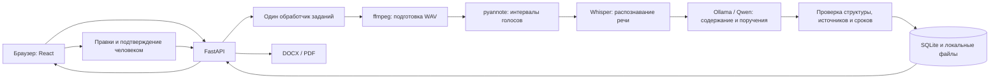

# Jinalys AI

## 1. Название проекта

**Jinalys AI**

*От встречи к решениям.*

## 2. Краткое описание

**Запись встречи → стенограмма с говорящими → содержание и поручения → проверка человеком → DOCX / PDF.**

Jinalys AI помогает секретарям и организаторам совещаний подготовить протокол по аудиозаписи. Вместо повторного прослушивания всей встречи пользователь получает редактируемый черновик и может проверить основания поручений по конкретным репликам.

Результат работы ИИ не считается утверждённым протоколом: имена, поручения и сроки проверяет человек. Основная версия использует локальные модели **Transformers + Whisper Turbo, pyannote Community-1 и Ollama/Qwen3-8B**.

## 3. Что реализовано

- **Загрузка MP3 и WAV**: до 200 MiB и 10 минут. Проверяются формат, длительность и целостность; звук подготавливается через ffmpeg.
- **Распознавание речи и разделение голосов**: реплики содержат текст, временной интервал и идентификатор говорящего. Неопределённые голоса и одновременная речь отмечаются отдельно.
- **Краткое содержание и кандидаты в поручения**: действие, ответственный, исходная фраза срока, дата исполнения, ссылки на реплики основания и подтверждения.
- **Проверка источников**: ссылки должны вести на существующие реплики. Ответственный и фраза срока проверяются на присутствие в цитируемом тексте. Неоднозначные даты остаются на уточнение.
- **Редактирование человеком**: исправление стенограммы, назначение проверенных имён голосам, изменение содержания, добавление и удаление кандидатов в поручения.
- **Интерфейс с вкладками**: «Обзор», «Стенограмма», «Участники», «Поручения», «Экспорт». Плеер и кнопка сохранения доступны при переключении разделов; можно прослушать отдельную реплику.
- **Сохранение работы**: SQLite хранит результаты и правки. Ссылку вида `?meeting=<id>` можно использовать для повторного открытия встречи. Ошибочную обработку можно запустить повторно.
- **Экспорт**: DOCX и, при наличии LibreOffice, PDF. Если PDF не сформирован, готовый DOCX остаётся доступным. Непроверенные кандидаты выделяются в документе.

Изменения исходных реплик, участников или содержания поручения снимают соответствующее подтверждение: сначала нужно сохранить правки, затем повторно проверить поручение.

### Ограничения текущей версии

- **Черновик требует проверки человеком.** Наличие корректного JSON и ссылок на реплики не доказывает правильность содержания поручения.
- **Языковое качество не гарантировано.** Русская, казахская и смешанная речь входят в сценарии проекта, но полная оценка естественной многосторонней речи не завершена. Итоговые WER/CER и точность поручений в этом README не заявляются.
- **Говорящие не идентифицируются по личности.** Модель выделяет голосовые интервалы; имена назначаются вручную. Наложения речи, короткие фрагменты и границы реплик требуют проверки. Время соответствует окнам обработки, а не точному выравниванию каждого слова.
- **Даты нормализуются консервативно.** Например, календарная дата без года остаётся на уточнение; список участников не служит доказательством назначения ответственного.
- **Ограниченный объём и параллелизм.** До 10 минут и 200 MiB на запись, один процесс сервера и один обработчик. Минимальные требования к памяти и гарантированное время обработки не установлены.
- **Локальная доверенная среда.** Нет встроенной аутентификации, ролей пользователей и готовой защиты публичного сервиса. Для удалённого доступа используйте SSH-туннель.
- **PDF зависит от LibreOffice и шрифтов.** DOCX доступен отдельно.
- **Нет live-подключения к Teams, Zoom или Meet**, потоковой расшифровки, интеграции с СЭД, автоматической рассылки, напоминаний и дашборда исполнения поручений.

Состояние проверок и дальнейшая работа описаны в [плане реализации](docs/implementation-plan.md). Выбор моделей и его ограничения — в [исследовании моделей](docs/research/2026-09-23-model-selection.md).

## 4. Как работает решение

1. Пользователь загружает разрешённую запись, указывает дату встречи и, при необходимости, участников.
2. Сервер подготавливает монофонический WAV, 16 кГц. Модель pyannote определяет интервалы голосов.
3. Whisper распознаёт речь в коротких окнах до 25 секунд. Сервер сопоставляет текст с интервалами говорящих и отмечает неопределённость.
4. Qwen получает стенограмму и формирует структурированный JSON: краткое содержание и кандидаты в поручения. Программа проверяет формат, ссылки на источники и однозначные сроки.
5. Пользователь прослушивает спорные фрагменты, исправляет текст и имена, проверяет действие, ответственного, срок и подтверждение каждого поручения.
6. После сохранения пользователь создаёт DOCX или DOCX и PDF для дальнейшего согласования.

## 5. Технологии

| Компонент | Технологии и назначение |
| --- | --- |
| Интерфейс | TypeScript, React, Vite; CSS для оформления и адаптивной компоновки |
| Сервер | Python, FastAPI, Uvicorn; Pydantic для проверки данных |
| Хранение | SQLite для встреч и правок; файловая система для аудио и документов |
| Подготовка аудио | ffmpeg, ffprobe, NumPy |
| Распознавание речи | `openai/whisper-large-v3-turbo`, Hugging Face Transformers, PyTorch |
| Разделение голосов | `pyannote/speaker-diarization-community-1`, `pyannote.audio` |
| Содержание и поручения | `qwen3:8b`, квантование Q4_K_M, локальный HTTP API Ollama |
| Документы | `python-docx`; LibreOffice для преобразования DOCX в PDF |
| Проверки | pytest, FastAPI TestClient/httpx; Vitest, Testing Library, jsdom |
| Подготовка моделей | Hugging Face Hub для предварительной загрузки весов |

Ревизии моделей и ожидаемый digest Qwen указаны в [backend/models.json](backend/models.json). Зависимости серверной логики и окружения GPU разделены на [requirements.txt](backend/requirements.txt) и [requirements-gpu.txt](backend/requirements-gpu.txt). Зависимости интерфейса фиксирует `frontend/package-lock.json`.

## 6. Архитектура проекта



Модели речи вызываются последовательно; после использования освобождаются ссылки на модель и очищается кэш GPU. Встроенный обработчик запускает одно задание за раз. Приложение следует запускать **одним процессом Uvicorn**.

```text
backend/
  app/
    main.py           API и очередь обработки
    audio.py          подготовка аудио, диаризация и распознавание
    process.py        сопоставление реплик и голосов
    extract.py        запрос к Qwen, проверка источников и сроков
    review.py         валидация пользовательских правок
    store.py          SQLite и файлы
    export.py         DOCX и PDF
    serve.py          точка запуска
  scripts/            проверка окружения и модельные прогоны
  tests/              автоматические тесты
  models.json         модели и ревизии
frontend/             интерфейс, сборка и тесты
evaluation/           сценарии и материалы оценки
docs/                 план реализации и исследование моделей
variants/llamacpp/     отдельный альтернативный вариант
```

Основной запуск описан ниже. В [variants/llamacpp](variants/llamacpp/README.md) сохранён отдельный вариант на CTranslate2, pyannote 3.1 и Qwen3.5-4B/llama.cpp. Его зависимости и конфигурация не относятся к основному стеку этого README.

## 7. Установка и запуск

Команды рассчитаны на **Bash в Linux или WSL** и выполняются из корня проекта, если не указано другое.

### 7.1. Подготовьте окружение

Нужны:

- Python 3.11 и модуль `venv`;
- Node.js 22 и npm;
- ffmpeg и ffprobe в `PATH`;
- установленный Ollama;
- для PDF — LibreOffice и шрифт с кириллицей и казахскими символами, например DejaVu Sans.

В репозитории описано GPU-окружение Brev с NVIDIA L40S 48 GB и CUDA 12.6. Это конфигурация для проверки, а не доказанные минимальные требования. Код поддерживает выбор CPU при отсутствии CUDA, но приемлемое время полного прогона на CPU не заявлено.

Создайте отдельное окружение и установите зависимости полного конвейера:

```bash
python3.11 -m venv .venv
source .venv/bin/activate
python -m pip install -r backend/requirements-gpu.txt

cd frontend
npm ci
npm run build
cd ..
```

`requirements-gpu.txt` содержит зафиксированные CUDA-зависимости. Не устанавливайте поверх него `requirements.txt`: этот файл предназначен для отдельного окружения тестов серверной логики.

### 7.2. Запустите Ollama

В отдельном терминале:

```bash
export OLLAMA_NO_CLOUD=1
export OLLAMA_NOPRUNE=1
ollama serve
```

Если локальный сервис уже работает, второй процесс запускать не нужно. Приложение обращается к нему по адресу `http://127.0.0.1:11434`.

### 7.3. Загрузите модели заранее

Этот шаг требует интернета. Для Community-1 примите условия доступа на Hugging Face и при необходимости выполните `hf auth login` в своём окружении. Не добавляйте токены в репозиторий.

В терминале приложения с активированным `.venv`:

```bash
export MEETING_MODELS="$PWD/models"
export HF_HOME="$MEETING_MODELS/hf"
export ASR_MODEL_PATH="$MEETING_MODELS/whisper-large-v3-turbo"
export PYANNOTE_DIARIZATION_MODEL="$MEETING_MODELS/speaker-diarization-community-1"

python - <<'PY'
import json
import os
from pathlib import Path
from huggingface_hub import snapshot_download

models = json.loads(Path("backend/models.json").read_text())
for name in ("asr", "diarization"):
    model = models[name]
    snapshot_download(
        model["repository"],
        revision=model["revision"],
        local_dir=os.environ[model["environment_variable"]],
    )
PY

ollama pull qwen3:8b
```

Сверьте digest модели в ответе `http://127.0.0.1:11434/api/tags` с `backend/models.json`: содержимое изменяемого тега `qwen3:8b` может отличаться. Казахская дообученная ASR-модель в манифесте — отдельный кандидат; приведённая команда её не загружает.

### 7.4. Проверьте настройки и запустите приложение

Продолжайте в том же терминале, чтобы сохранить переменные путей к моделям:

```bash
export DB_PATH="$PWD/meeting-data/meetings.sqlite"
export STORAGE_DIR="$PWD/meeting-data/files"
export HF_HUB_OFFLINE=1
export TRANSFORMERS_OFFLINE=1
export HF_HUB_DISABLE_TELEMETRY=1
export PYANNOTE_METRICS_ENABLED=0

python backend/scripts/doctor.py

PYTHONPATH=backend uvicorn app.serve:app \
  --host 127.0.0.1 --port 8000 --workers 1
```

Откройте **[http://127.0.0.1:8000](http://127.0.0.1:8000)**. Сервер раздаёт собранный интерфейс из `frontend/dist`.

`doctor.py` проверяет наличие инструментов, библиотек, артефактов и Qwen в Ollama. Результат `ready: true` ещё не доказывает успешную загрузку всех моделей или качество распознавания. При `ready: false` устраните отмеченные проблемы до обработки записи.

Пример настроек — [.env.example](.env.example). **Сервер не читает `.env` автоматически**: переменные нужно экспортировать в терминал запуска. При повторном запуске также задайте пути из шага 7.3.

### 7.5. Только просмотр интерфейса или разработка

Чтобы открыть интерфейс без установки моделей, в отдельном Python-окружении установите `backend/requirements.txt`, соберите frontend и запустите Uvicorn с `DB_PATH` и `STORAGE_DIR`, как выше. Полная обработка аудио без моделей недоступна.

Для разработки интерфейса при работающем backend на порту 8000:

```bash
cd frontend
npm run dev -- --host 127.0.0.1
```

Vite покажет адрес интерфейса и перенаправит запросы `/meetings` на backend.

### 7.6. Демо и удалённый доступ

**Подтверждённая публичная ссылка на deployed-версию в репозитории не указана.** Адрес `http://127.0.0.1:8000` относится к локально запущенному приложению и не является публичным демо.

Для доступа к экземпляру на удалённой машине, включая Brev, запустите приложение там, затем на своём компьютере откройте туннель:

```bash
ssh -NT -L 8000:127.0.0.1:8000 USER@HOST
```

Замените `USER@HOST` данными вашей машины и откройте **[http://localhost:8000](http://localhost:8000)**. Если сервер использует другой порт, измените удалённый порт в команде. Доступ к машине и подготовленные модели для такой демонстрации предоставляются отдельно.

## 8. Как проверить решение

### Пользовательский сценарий

Для повторения нужна подготовленная установка из раздела 7 и собственная короткая MP3/WAV-запись. Реальные записи трека в Git не включены: каталог `track/` исключён через `.gitignore`.

Можно записать небольшой **тестовый диалог** двух участников:

> — Айгүл, подготовьте отчёт по аудиту до 30 сентября 2026 года.
>
> — Хорошо, подготовлю отчёт к указанной дате.
>
> — Предлагаю отдельно обсудить обновление оборудования на следующей встрече.

Для этого вымышленного сценария укажите дату встречи **23 сентября 2026 года**. Для реальной записи используйте фактическую дату.

1. Откройте приложение, загрузите запись, введите дату и участников. Нажмите **«Загрузить и обработать»**.
2. Дождитесь статуса **«Черновик готов к проверке»**. При ошибке изучите сообщение; доступен повторный запуск.
3. На вкладке **«Обзор»** проверьте содержание. На вкладке **«Стенограмма»** прослушайте реплики и исправьте ошибки.
4. Во вкладке **«Участники»** назначьте голосам проверенные имена. Сохраните правки.
5. Во вкладке **«Поручения»** проверьте действие, ответственного, срок, основание и подтверждение. Убедитесь, что предложение обсудить оборудование не стало автоматически подтверждённым поручением.
6. Сохраните исправления. Если есть подтверждающая реплика и полномочия участника проверены, отметьте подтверждение поручения и сохраните ещё раз.
7. Во вкладке **«Экспорт»** создайте DOCX. При настроенном LibreOffice проверьте также PDF.
8. Обновите страницу по сохранённой ссылке встречи: правки должны остаться. Проверьте, что документ содержит сохранённые данные и обозначен как черновик.

Точный текст ответа модели не гарантируется. Критерии проверки — соответствие записи, проверяемые ссылки на реплики, сохранность правок и корректное разделение проверенных поручений и кандидатов.

### Автоматические тесты

В окружении полного конвейера зависимости для этих проверок уже установлены:

```bash
PYTHONPATH=backend python -m pytest backend/tests -q
npm test --prefix frontend
npm run build --prefix frontend
```

Для backend-тестов без весов достаточно отдельного окружения с `backend/requirements.txt`; для тестов аудио нужен ffmpeg. Тесты используют подмены моделей и проверяют поведение приложения, а не точность распознавания реальной речи.

### Полный прогон из командной строки

После подготовки моделей и запуска Ollama можно проверить запись без браузера:

```bash
# Подставьте путь к своей записи и её фактическую дату.
export TEST_AUDIO="/absolute/path/meeting.mp3"
export TEST_DATE="2026-09-23"

PYTHONPATH=backend timeout 35m python backend/scripts/brev_smoke.py \
  "$TEST_AUDIO" --meeting-date "$TEST_DATE" \
  --data-dir meeting-data/jury-check \
  --report meeting-data/jury-report.json \
  --result meeting-data/jury-result.json \
  --deny-external-python-network
```

`success: true` в отчёте означает технически успешную обработку и получение DOCX. Отчёт также содержит время выполнения, статус, количество реплик и поручений, а при доступном `nvidia-smi` — показания использования памяти GPU. Полный результат сохраняется отдельно для ручной проверки; он содержит текст записи.

Флаг `--deny-external-python-network` ограничивает только Python-процесс. Для проверки изоляции также Ollama предусмотрен `backend/scripts/offline_smoke.sh`; требования и команды приведены в [evaluation/README.md](evaluation/README.md).

## 9. Данные и интеграции

| Источник или компонент | Как используется |
| --- | --- |
| Пользовательские записи | MP3/WAV, дата встречи и необязательный список участников; аудио и результаты хранятся на машине приложения |
| Hugging Face Hub | Предварительная загрузка снимков Whisper и pyannote; во время обработки используются локальные каталоги |
| Ollama | Локальный запрос `POST /api/chat` к Qwen по `127.0.0.1:11434`; HTTP-прокси игнорируются, перенаправления запрещены |
| FastAPI | Загрузка, запуск обработки, получение результата, правки, воспроизведение аудио, экспорт и удаление встречи через `/meetings` |
| Материалы оценки | [evaluation/cases.json](evaluation/cases.json) и [evaluation/simulated.json](evaluation/simulated.json): сценарии для ручной оценки и синтетические случаи |
| Brev | Описанная в документации GPU-машина для испытаний; не обязательная зависимость приложения |

Веса, рабочие базы, локальные `.env` и записи исключены из Git. Обработка не требует облачного API распознавания или внешнего LLM API. Подготовка окружения и загрузка весов требуют сети.
